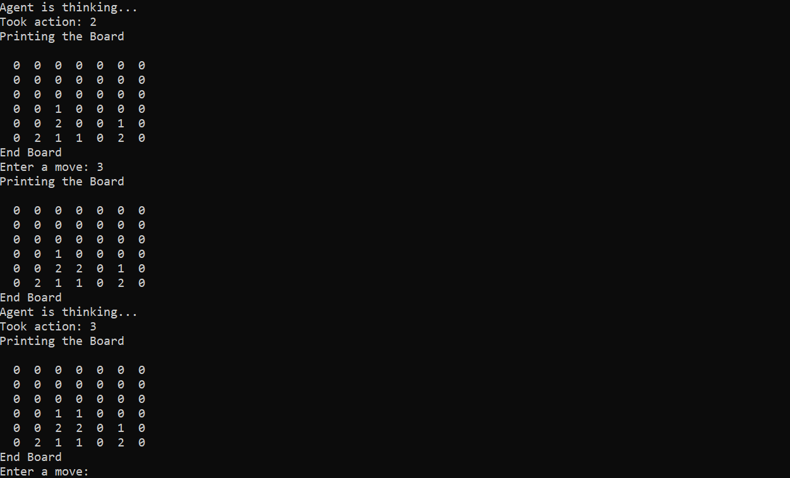

# Connect-Four

A Connect-Four environment and simple AI model. Written in python. AI uses a minimax alorithm with alpha-beta pruning to determine the best move to play on the board. Currently looks ~9 moves ahead. ASCII user interface.

